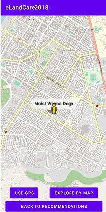
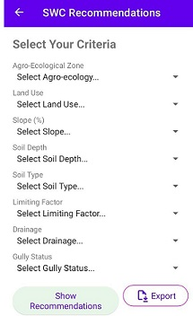
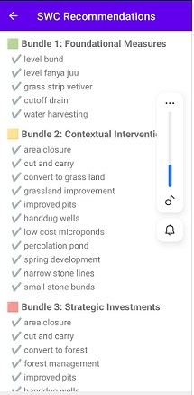

# eLandCare-Ethiopia
Your mobile guide to smart Soil and Water Conservation (SWC) in Ethiopia

## 🔍 Key Features
### ✅ Personalized SWC Recommendations
Get site-specific conservation practices grouped into three practical bundles:
Foundational: Basic, low-cost measures
Contextual: Practices adapted to your land’s conditions
Strategic: Advanced, long-term interventions
### 🌍 Agro-Ecological Zone (AEZ) Explorer
Automatically detect your AEZ using GPS

Or explore any location on an interactive map (works offline after initial load)

### 📤 Export Results
Save your inputs and recommendations as a CSV file for planning or sharing
### 📱 Fully Offline Functionality
No internet needed for SWC recommendations—ideal for rural areas
## 📥 Installation
Option 1: Google Play Store (Recommended)
- Open the Google Play Store
- Search for “eLandCare”
- Tap Install
Option 2: Install from GitHub (APK)
- Go to the Releases page
- Download the latest .apk file (e.g., eLandCare-v1.0.apk)
- Enable “Install unknown apps” for your browser (see manual for details)
- Open the downloaded file and tap Install
## ℹ️ First-time users: See the User Manual for step-by-step guidance. 

## 📚 Documentation
### 📄 eLandCare User Manual (PDF)
Download the PDF file 
[📖 eLandCare User Manual (PDF)](eLandCare%20User%20Manual20251006.pdf)
Includes:
- How to get SWC recommendations

- How to explore AEZs with GPS or map
- Installation instructions for all user types
- FAQs and troubleshooting tips
### ❓ Frequently Asked Questions
- Q: Do I need internet to use the app?
- A: Only for the map feature (to load tiles). SWC recommendations work fully offline.

- Q: Why does the app ask for location permission?
- A: Only to show your position on the map in the AEZ Explorer. Your location is not stored or shared.

- Q: The app crashed—what should I do?
- A: Restart the app. If the problem continues, contact support via the “About This App” section.

## 🤝 Acknowledgments

## 🤝 Developed By
•	Initiated  and conceptualized by 

•	Developed by
## ✅ Validated by
•	 ..
## 📄 License
This project is licensed under the MIT License – see the LICENSE file for details.
