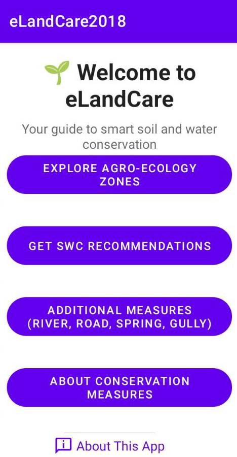
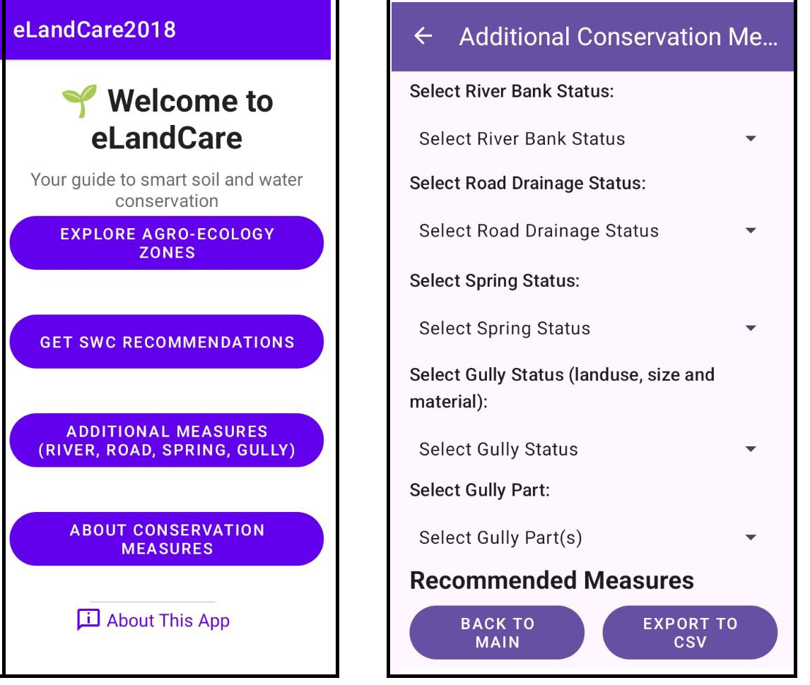

# 🌱 Welcome to eLandCare!

**Your guide to smart soil and water conservation in Ethiopia.**

eLandCare is a mobile app designed for professionals in agriculture, forestry, and land management. It provides site-specific recommendations for soil and water conservation based on field observations, helping you make smart choices to enhance productivity and protect natural resources.

## 📱 Screenshots

**Welcome Screen**

**SWC Recommendations Form**

**Recommendation Bundles**

## 🛠️ Key Features

*   **Streamlined Field Data Collection:** Input data on agro-ecology, land use, slope, soil depth, soil type, drainage, and gully presence.
*   **Ecological Zone Identification:** Use the interactive map tool to identify the Agro-Ecological Zone of your location.
*   **Automated Conservation Recommendations:** Receive tailored conservation plans based on your specific site conditions.
*   **Full Offline Functionality:** The app works entirely offline in remote areas. Map data, once downloaded with an internet connection, remains available for offline use.

## 👥 Who Is It For?

*   Field workers and development agents in agriculture, forestry, and watershed management.
*   Planners and researchers using spatial data for decision-making.
*   Educators and students in natural resources and GIS.
*   Government staff aligning conservation efforts with local priorities.
*   Policy makers and program leads seeking data-driven guidance.

## 🔒 Privacy

We are committed to protecting your privacy.
*   **No Personal Data Collection:** This app does not collect, store, or transmit any personal data.
*   **Location Data:** Location is used only to identify your Agro-Ecological Zone on the map and is never stored or shared.

## Acknowledgment, Developers, and Validators

### Acknowledgment
The soil and water conservation decision support tool was developed in collaboration with the expertise from the Ministry of Agriculture (MoA) and used many of their resources available (e.g. MOA, 2016 agro-ecological classification, soil and water conservation manuals). We are grateful for this.

This tool was developed as part of the CGIAR science program Scaling for Impact (S4I) in East and Southern Africa, which is grateful for the support of CGIAR Trust Fund contributors and Nature-Based Solutions for Inclusive and Sustainable Development (NSSID) funded by Swedish SIDA.

### Developed By

*   **Initiated and Conceptualized by:**
    *   **Amare Haileslassie**, Principal Researcher, Agricultural Water Management and Ecosystem Services, International Water Management Institute (IWMI).
    *   **Wolde Mekuria**, Senior Researcher, Environment and Development, IWMI.

*   **Developed by:**
    *   **Kefyalew Sahle**, Lecturer at Hawassa University, Wondo Genet College of Forestry and Natural Resources, Department of Geographic Information Science (GISc). GIS and Mobile Application Developer with specialized expertise in forestry, land use planning, and spatial decision support systems.

### Validated By

*   **Fekede Adane** and **Abinet Mengistu**, soil and water conservation experts, Ministry of Agriculture.
*   **Tarku Temesegen**, rural development, Farm Africa.

---

### **To Install the App:**

1.  Download the `eLandCare-v1.0.0.apk` file below from the **Assets** section.
2.  Open the file on your Android device to install it. You may need to allow installations from unknown sources in your phone's settings.

